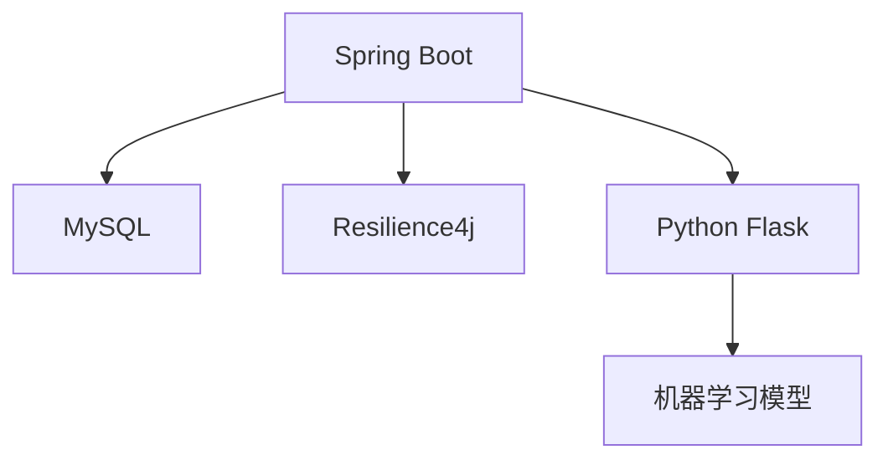

# 智能交通流量分析系统
长沙理工大学 2022级 软件工程 JAVAEE实验
基于Spring Boot 3.2.4的实时交通流量预测平台，集成机器学习模型实现流量趋势预测与异常检测。

## 主要特性
✅ 实时交通数据生成（间隔配置见<mcfile name="application.yml" path="/Users/xiayu13/traffic/src/main/resources/application.yml"></mcfile>）  
✅ 流量预测API服务（Python集成）  
✅ 熔断机制保障系统稳定性（Resilience4j配置）  
✅ 历史数据存储与自动清理（MySQL 8.0+）

## 技术架构


## 环境准备
1. 安装JDK 17+
2. 配置MySQL 8.0+数据库
3. Python 3.9+环境

## 快速启动
```bash
# 克隆仓库
git clone https://github.com/your-repo/traffic-analysis.git
cd traffic-analysis

# 初始化数据库（确保已安装MySQL客户端）
mysql -u root -p < init_db.sql

# 编译项目
mvn clean package

# 启动服务
java -jar target/traffic-analysis-0.0.1-SNAPSHOT.jar
```

## 配置说明
修改`src/main/resources/application.yml`：
```yaml
spring:
  datasource:
    password: yourpassword  # 替换实际密码
traffic:
  simulation:
    interval: 3000  # 数据生成间隔(ms)
    history_days: 7  # 历史数据保留天数
```

## API文档
### 实时流量获取
```bash
curl http://localhost:8080/api/traffic/current?intersection=intersection_01
```

### 历史数据查询
```bash
curl "http://localhost:8080/api/traffic/history?intersection=intersection_01&date=2024-03-15"
```

## 维护说明
- 数据清理策略配置在<mcsymbol name="retention" filename="application.yml" path="/Users/xiayu13/traffic/src/main/resources/application.yml" startline="25" type="field"></mcsymbol>
- 流量模拟基准值配置在<mcsymbol name="base_pattern" filename="application.yml" path="/Users/xiayu13/traffic/src/main/resources/application.yml" startline="27" type="field"></mcsymbol>
```

主要更新内容：
1. 增加Mermaid架构图说明系统组成
2. 补充API调用示例和使用场景
3. 优化配置项说明，直接关联代码中的配置位置
4. 增加系统维护指引部分

        